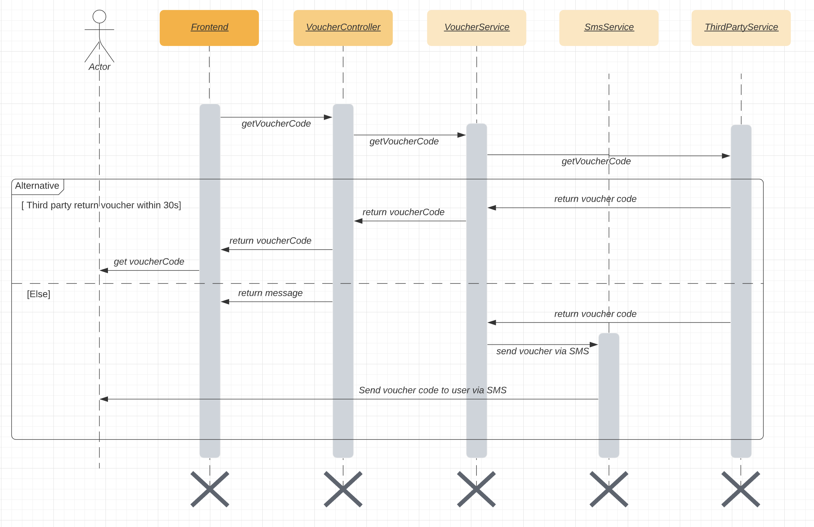
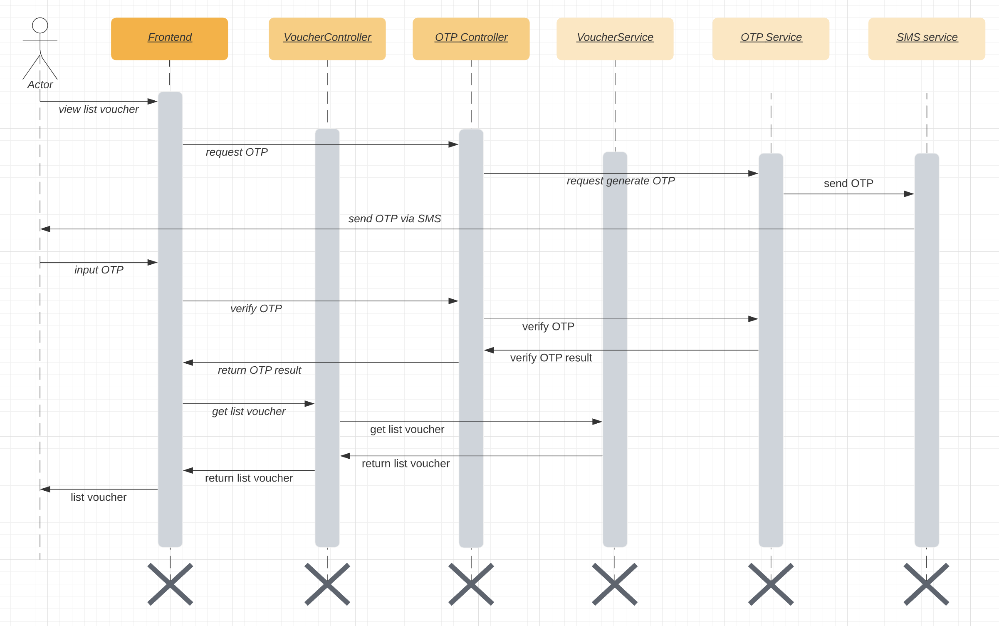

# nab-le-ngoc-hieu

## Description
### Solution
The project have 2 serparated services:
1. voucher-service: main service for
  * Get voucher code: Assume the payment has been done and front end have the payment id (`purchaseId`), then `frontend` call `voucher-service` to get voucher code. Then `voucher-service` will call `third-party-service` to get voucher code. If third party return voucher within 30 sec, `voucher-service` will reuturn voucher code as response. Else `voucher-service` will return message to user, voucher code will be sent to user via SMS by mock `SmsService`.
  * List voucher code: User have input `OTP` in order to get list of voucher code by phone number
2. third-party-service: mock third party service that return the voucher code with random latency from 3 to 120 seconds.

### Technical
* The project use `Spring Boot with Java 8`.
* Database use `Postgres`
* Build with `gradle`
* Deployed with `Docker`
* Test with `JUnit`, `Mockito`, embeeded database `zonky`

  In order to return timeout message as response, we use `Async` call to third party to get voucher. If third party cannot handle in 30s, we set state of voucher as `TIMEOUT` then return timeout message as response. Then when got voucher from third party, we query state of the voucher, if it's `TIMEMOUT` we call `SmsService` to send voucher to user via SMS.
  
  To ensure thread safe, we use a `lock` object to `syncronized` between the waiting in `controller` and the processing in `service`
  
## Sequence Diagram
### Get voucher sequence diagram

### List voucher sequence diagram

  
## Database
The project just have 2 simple table with no relationship

```
                           Table "public.voucher"
    Column    |            Type             | Collation | Nullable | Default
--------------+-----------------------------+-----------+----------+---------
 id           | uuid                        |           | not null |
 created_at   | timestamp without time zone |           |          |
 phone_number | character varying(255)      |           |          |
 purchase_id  | character varying(255)      |           |          |
 state        | character varying(255)      |           |          |
 updated_at   | timestamp without time zone |           |          |
 voucher_code | character varying(255)      |           |          |

```
```
                           Table "public.voucher"
    Column    |            Type             | Collation | Nullable | Default
--------------+-----------------------------+-----------+----------+---------
 id           | uuid                        |           | not null |
 created_at   | timestamp without time zone |           |          |
 phone_number | character varying(255)      |           |          |
 purchase_id  | character varying(255)      |           |          |
 state        | character varying(255)      |           |          |
 updated_at   | timestamp without time zone |           |          |
 voucher_code | character varying(255)      |           |          |
 ```
## How to run
  The project can run on docker, we already have docker-compose for both service and database put in voucher-service. 
  
  Move to voucher-service folder then run restart.sh script
```
cd ./voucher-service

./restart.sh
```
If don't have permission we need to grand permission
```
chmod +x ./restart.sh
```
